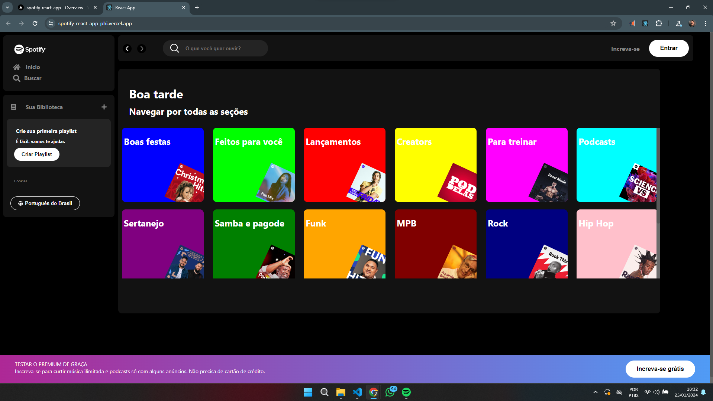

# 🎵 Spotify React App 🎵

Este é um projeto que recria a interface do Spotify usando React. O objetivo é aprender e praticar o desenvolvimento de aplicações web modernas com React.

## 🎯 Objetivo

O objetivo deste projeto foi criar uma versão da interface do Spotify. 

## 🚀 Demonstração

Veja o Spotify React App em funcionamento [aqui](https://spotify-react-app-phi.vercel.app/).

## 💡 Motivação

A motivação por trás deste projeto é aprimorar minhas habilidades em React e aprender mais sobre o desenvolvimento de aplicações web modernas. Além disso, é uma ótima oportunidade para colocar meus conhecimentos em ação e me desafiar.

## 🎓 Imersão Alura

Estou participando da Imersão de front-end da Alura 👩‍💻

Este evento, promovido pela Alura, tem como objetivo a prática e o ensino de conceitos front end. O desafio proposto é criar um clone da página do Spotify utilizando CSS, HTML e JavaScript.

No entanto, decidi me desafiar ainda mais e estou desenvolvendo este projeto utilizando o framework React. Estou animado para aplicar e aprofundar meus conhecimentos neste framework enquanto participo desta imersão!

## 🙌 Contribuindo

Contribuições são muito bem-vindas! Se você tem uma ideia para melhorar , sinta-se à vontade para abrir uma issue ou um pull request.

## 📜 Licença

Este projeto está licenciado sob a licença MIT.